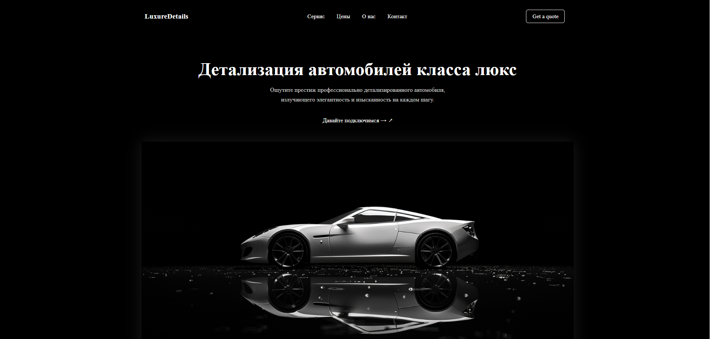

# Luxury Car Landing



- [Дизайн](https://www.figma.com/design/YEuQIpkKqpy4m3olwAtd3v/Luxury-Car-Detailing-Landing-Page--Community-?node-id=2-139&t=tpUWEfg9TMW9uLps-1)
- [Демо](https://dg0st.github.io/luxurycar_landing)

# Luxury Car Landing — многоформатный шаблон

Этот репозиторий содержит несколько реализаций одной целевой страницы **Luxury Car Landing**, включая:

- Чистый HTML/SCSS/JS-макет
- Тема WordPress
- Версия Django

---

## Структура проекта

```bash
luxurycar_landing/
├── assets/           # Общие стили, скрипты, изображения
├── wp-theme/         # Тема WordPress
├── django-version/   # Приложение Django
└── README.md         # Этот файл
```

---

## Использование

### HTML

Откройте `html-version/index.html` в браузере. Все стили и скрипты включены из `../assets`.

### WordPress

1. Перейдите в `wp-theme/`
2. Скопируйте папку в `wp-content/themes/` вашего сайта WordPress
3. Активируйте тему через панель администратора

### Django

1. Перейдите в `django-version/`
2. Установите зависимости:

```bash
pip install -r requirements.txt

```

## Особенности

- Унифицированная компоновка для разных стеков
- Удобная структура для поддержки
- Быстрое переключение между форматами

## Автор

Разработано dg0st
